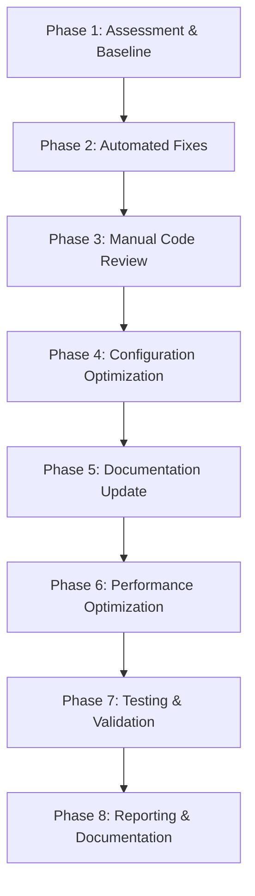
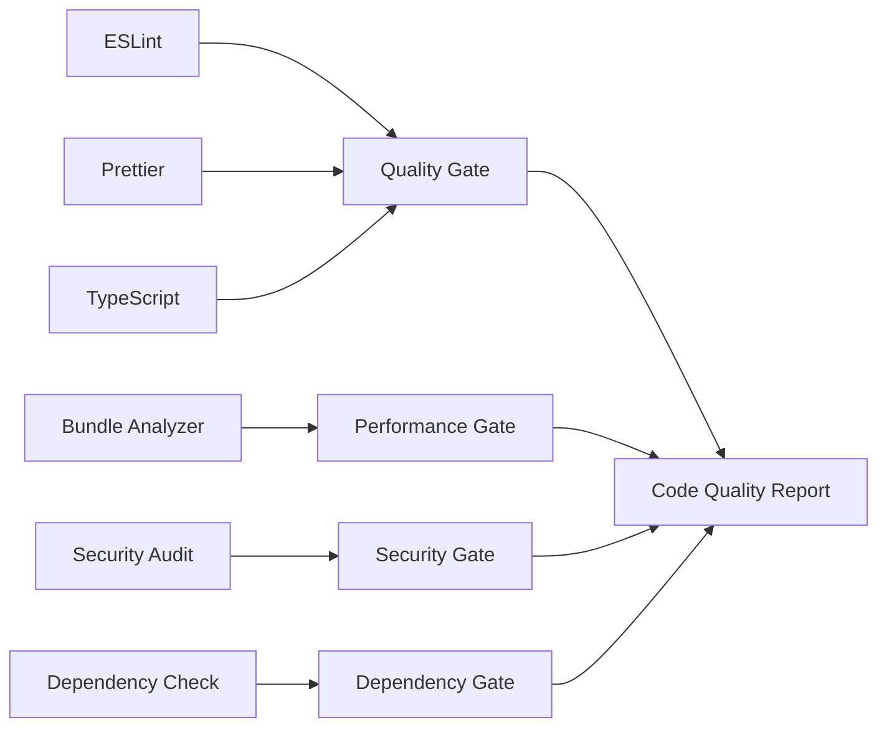

# Design Document - Project Cleanup & Code Standardization

## Overview

This design document outlines the technical approach for implementing a comprehensive cleanup and standardization of the IATECH frontend codebase. The cleanup will be executed in phases to minimize disruption while maximizing impact, using automated tools where possible and manual review where necessary.

The design follows a systematic approach that prioritizes safety, measurability, and maintainability. Each phase builds upon the previous one, ensuring that improvements are stable before proceeding to the next level of optimization.

## Architecture

### Cleanup Phases Architecture



### Tool Integration Strategy



## Components and Interfaces

### 1. Code Quality Management System

#### ESLint Configuration Manager
```typescript
interface ESLintConfig {
  extends: string[];
  rules: Record<string, any>;
  overrides: ESLintOverride[];
  ignorePatterns: string[];
}

interface ESLintOverride {
  files: string[];
  rules: Record<string, any>;
  env?: Record<string, boolean>;
}
```

**Responsibilities:**
- Standardize linting rules across all file types
- Configure TypeScript-specific rules
- Set up React and Next.js specific linting
- Define custom rules for project-specific patterns

#### Prettier Configuration Manager
```typescript
interface PrettierConfig {
  semi: boolean;
  trailingComma: 'es5' | 'none' | 'all';
  singleQuote: boolean;
  printWidth: number;
  tabWidth: number;
  useTabs: boolean;
}
```

**Responsibilities:**
- Ensure consistent code formatting
- Configure integration with ESLint
- Set up IDE integration
- Define formatting rules for different file types

### 2. Dependency Management System

#### Package Analyzer
```typescript
interface PackageAnalysis {
  unused: string[];
  outdated: PackageUpdate[];
  vulnerable: VulnerabilityReport[];
  duplicates: DuplicatePackage[];
  peerDependencyIssues: PeerDependencyIssue[];
}

interface PackageUpdate {
  name: string;
  current: string;
  wanted: string;
  latest: string;
  type: 'major' | 'minor' | 'patch';
}
```

**Responsibilities:**
- Identify unused dependencies
- Detect security vulnerabilities
- Find duplicate packages
- Analyze peer dependency conflicts
- Recommend safe updates

#### Bundle Optimizer
```typescript
interface BundleAnalysis {
  totalSize: number;
  chunks: ChunkInfo[];
  unusedExports: string[];
  duplicateModules: string[];
  recommendations: OptimizationRecommendation[];
}

interface ChunkInfo {
  name: string;
  size: number;
  modules: ModuleInfo[];
}
```

**Responsibilities:**
- Analyze bundle composition
- Identify optimization opportunities
- Detect code splitting issues
- Recommend lazy loading strategies

### 3. Configuration Management System

#### Environment Configuration Manager
```typescript
interface EnvironmentConfig {
  development: EnvVars;
  production: EnvVars;
  staging?: EnvVars;
  required: string[];
  optional: string[];
}

interface EnvVars {
  [key: string]: string | undefined;
}
```

**Responsibilities:**
- Validate environment variable completeness
- Ensure proper .env.example maintenance
- Check for hardcoded values
- Verify environment-specific configurations

#### Build Configuration Optimizer
```typescript
interface BuildConfig {
  nextConfig: NextConfig;
  tsConfig: TypeScriptConfig;
  tailwindConfig: TailwindConfig;
  storybookConfig: StorybookConfig;
}
```

**Responsibilities:**
- Optimize Next.js configuration
- Configure TypeScript compiler options
- Set up proper path mappings
- Optimize Tailwind CSS configuration

### 4. Documentation Management System

#### Documentation Auditor
```typescript
interface DocumentationAudit {
  outdatedFiles: string[];
  missingDocumentation: string[];
  inconsistencies: DocumentationIssue[];
  coverageScore: number;
}

interface DocumentationIssue {
  file: string;
  issue: string;
  severity: 'low' | 'medium' | 'high';
  suggestion: string;
}
```

**Responsibilities:**
- Audit existing documentation
- Identify outdated information
- Check for missing documentation
- Validate documentation consistency

#### Steering Files Manager
```typescript
interface SteeringFileUpdate {
  file: string;
  currentContent: string;
  updatedContent: string;
  changes: ChangeDescription[];
}

interface ChangeDescription {
  section: string;
  type: 'added' | 'updated' | 'removed';
  description: string;
}
```

**Responsibilities:**
- Update project context documentation
- Refresh API documentation
- Update component inventory
- Maintain integration mappings

## Data Models

### Cleanup Report Model
```typescript
interface CleanupReport {
  id: string;
  timestamp: Date;
  phases: PhaseReport[];
  summary: CleanupSummary;
  metrics: QualityMetrics;
  recommendations: string[];
}

interface PhaseReport {
  phase: string;
  status: 'completed' | 'in-progress' | 'failed';
  duration: number;
  changes: ChangeLog[];
  issues: Issue[];
}

interface CleanupSummary {
  filesModified: number;
  lintErrorsFixed: number;
  dependenciesRemoved: number;
  dependenciesUpdated: number;
  vulnerabilitiesFixed: number;
  bundleSizeReduction: number;
}

interface QualityMetrics {
  before: QualityScore;
  after: QualityScore;
  improvement: QualityScore;
}

interface QualityScore {
  lintCompliance: number;
  typeScriptCompliance: number;
  testCoverage: number;
  bundleSize: number;
  performanceScore: number;
  securityScore: number;
}
```

### Configuration State Model
```typescript
interface ConfigurationState {
  eslint: {
    status: 'valid' | 'invalid' | 'missing';
    errors: string[];
    warnings: string[];
  };
  prettier: {
    status: 'configured' | 'not-configured';
    conflicts: string[];
  };
  typescript: {
    status: 'strict' | 'loose' | 'errors';
    errorCount: number;
    strictModeCompliance: number;
  };
  nextjs: {
    optimized: boolean;
    issues: string[];
    recommendations: string[];
  };
}
```

## Error Handling

### Cleanup Process Error Handling

#### Graceful Degradation Strategy
```typescript
interface ErrorHandlingStrategy {
  phase: string;
  errorTypes: ErrorType[];
  fallbackActions: FallbackAction[];
  rollbackProcedure: RollbackStep[];
}

interface ErrorType {
  type: string;
  severity: 'critical' | 'warning' | 'info';
  autoRecover: boolean;
  userAction: string;
}
```

**Error Categories:**
1. **Critical Errors**: Build failures, syntax errors, missing dependencies
2. **Warning Errors**: Linting issues, deprecated APIs, performance warnings
3. **Info Errors**: Style inconsistencies, documentation gaps, optimization opportunities

#### Rollback Mechanism
```typescript
interface RollbackManager {
  createCheckpoint(phase: string): CheckpointId;
  rollbackToCheckpoint(checkpointId: CheckpointId): Promise<void>;
  listCheckpoints(): Checkpoint[];
  cleanupCheckpoints(): void;
}

interface Checkpoint {
  id: CheckpointId;
  phase: string;
  timestamp: Date;
  fileStates: FileState[];
}
```

**Rollback Strategy:**
- Create checkpoints before each major phase
- Maintain file state snapshots
- Enable selective rollback of specific changes
- Preserve working configurations during failures

### Validation and Safety Checks

#### Pre-execution Validation
```typescript
interface PreExecutionChecks {
  gitStatus: GitStatus;
  nodeVersion: string;
  diskSpace: number;
  backupStatus: BackupStatus;
  dependencyIntegrity: boolean;
}

interface SafetyGate {
  name: string;
  check: () => Promise<boolean>;
  errorMessage: string;
  canProceed: boolean;
}
```

**Safety Gates:**
1. **Git Clean State**: Ensure no uncommitted changes
2. **Backup Verification**: Confirm backup creation
3. **Dependency Integrity**: Verify package-lock.json consistency
4. **Build Success**: Ensure current build works
5. **Test Pass**: Verify existing tests pass

## Testing Strategy

### Automated Testing Approach

#### Quality Assurance Pipeline
```typescript
interface QAPipeline {
  preCleanupTests: TestSuite[];
  postCleanupTests: TestSuite[];
  regressionTests: TestSuite[];
  performanceTests: TestSuite[];
}

interface TestSuite {
  name: string;
  tests: Test[];
  threshold: QualityThreshold;
  required: boolean;
}
```

**Testing Phases:**
1. **Baseline Testing**: Capture current state metrics
2. **Incremental Testing**: Test after each cleanup phase
3. **Regression Testing**: Ensure no functionality breaks
4. **Performance Testing**: Verify improvements
5. **Integration Testing**: Test with external services

#### Continuous Validation
```typescript
interface ContinuousValidation {
  lintingChecks: LintCheck[];
  buildChecks: BuildCheck[];
  testChecks: TestCheck[];
  performanceChecks: PerformanceCheck[];
}
```

**Validation Triggers:**
- After each file modification
- Before committing changes
- During build process
- Before deployment

### Manual Testing Procedures

#### User Acceptance Testing
```typescript
interface UATScenario {
  scenario: string;
  steps: string[];
  expectedOutcome: string;
  actualOutcome?: string;
  status: 'pass' | 'fail' | 'pending';
}
```

**Critical User Flows:**
1. Application startup and navigation
2. Authentication and authorization
3. Package browsing and filtering
4. Service discovery quiz completion
5. Admin dashboard functionality
6. Mobile responsiveness
7. Performance on slow connections

## Implementation Phases

### Phase 1: Assessment and Baseline (Day 1)
**Objective**: Establish current state and create safety checkpoints

**Activities:**
- Run comprehensive code analysis
- Create Git checkpoint
- Generate baseline metrics
- Identify critical issues
- Plan execution order

**Tools:**
- ESLint with all rules enabled
- TypeScript compiler in strict mode
- Bundle analyzer
- Security audit tools
- Custom analysis scripts

### Phase 2: Automated Fixes (Day 1-2)
**Objective**: Apply safe, automated improvements

**Activities:**
- Run ESLint --fix for auto-fixable issues
- Apply Prettier formatting
- Remove unused imports
- Fix TypeScript errors where possible
- Update simple configuration issues

**Safety Measures:**
- Test build after each major change
- Commit changes incrementally
- Validate no functionality breaks

### Phase 3: Manual Code Review (Day 2-3)
**Objective**: Address complex issues requiring human judgment

**Activities:**
- Review and fix complex TypeScript issues
- Refactor problematic code patterns
- Optimize component structures
- Improve error handling
- Enhance accessibility

**Review Criteria:**
- Code readability and maintainability
- Performance implications
- Security considerations
- Best practice compliance

### Phase 4: Configuration Optimization (Day 3)
**Objective**: Optimize all configuration files

**Activities:**
- Update Next.js configuration
- Optimize Tailwind CSS setup
- Configure TypeScript compiler options
- Set up proper environment variables
- Optimize build and deployment configs

**Validation:**
- Test in development environment
- Verify production build
- Check performance metrics
- Validate security settings

### Phase 5: Documentation Update (Day 4)
**Objective**: Ensure all documentation reflects current state

**Activities:**
- Update README.md
- Refresh steering files
- Update API documentation
- Create component inventory
- Document architectural decisions

**Quality Checks:**
- Documentation completeness
- Accuracy verification
- Consistency across files
- Usefulness for new developers

### Phase 6: Performance Optimization (Day 4-5)
**Objective**: Optimize bundle size and runtime performance

**Activities:**
- Analyze and optimize bundle composition
- Implement proper code splitting
- Optimize image usage
- Remove unused CSS
- Configure caching strategies

**Metrics:**
- Bundle size reduction
- First Contentful Paint improvement
- Largest Contentful Paint optimization
- Cumulative Layout Shift reduction

### Phase 7: Testing and Validation (Day 5)
**Objective**: Comprehensive testing of all changes

**Activities:**
- Run full test suite
- Perform manual testing
- Validate performance improvements
- Check security compliance
- Test deployment process

**Success Criteria:**
- All tests pass
- No regression in functionality
- Performance metrics improved
- Security vulnerabilities addressed

### Phase 8: Reporting and Documentation (Day 5)
**Objective**: Document all changes and improvements

**Activities:**
- Generate comprehensive cleanup report
- Document lessons learned
- Create maintenance guidelines
- Update development workflows
- Present results to stakeholders

**Deliverables:**
- Detailed cleanup report
- Before/after metrics comparison
- Updated development guidelines
- Maintenance recommendations